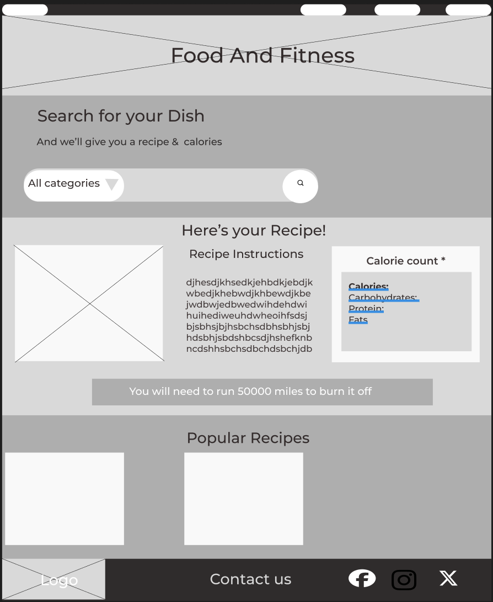

# "Is it Worth it?": Food and Fitness Tracker

# Project Description:

Ever wondered how long that cookie would take to burn off through exercise? Consider yourself a masochist? If so, then “Is it Worth it?” Is likely the application for you. Open Pandora’s Box and ruin your enjoyment of food forever after with this one-stop shop health and nutritional tool.

Our project allows a user to simply input a snack, meal, or favourite type of food, and then returns a two-fold response. The first feature serves to retrieve and display potential recipes for the user to make use of. The application will then tell you how long it would take to burn off the selected meal or snack through exercise based off the calories contained in that food, so that an informed decision can be made as to whether or not its nutritional value aligns with their current health and fitness goals (aka, is it ‘worth it’?).

# User Story

As a User, when I load the web page, 
I am presented with a form that prompts me to input a recipe name/dish of choice.
When I search for the recipe by clicking on the button,
I am presented with a card that dynamically displays the recipe label and associated image for said dish, along with the corresponding calories per portion for this particular recipe. A link to the full Recipe URL is also provided if the user requires more in-depth instructions or nutritional information.
As a User, a second card should display alongside our primary recipe information when I input my dish of choice, informing me of the approximate amount of time it would take to burn off a standard portion of this recipe though moderately paced running.

# Wireframe

# Documentation for the two APIs used:

https://developer.edamam.com/edamam-docs-recipe-api
https://api-ninjas.com/api/caloriesburned

# Project Presentation

"https://docs.google.com/presentation/d/e/2PACX-1vRecmCDfaClcnmKHQI71C0XIP9vVrroblQudaFqW5jZekzy5wqaxZVT_OMG8DYYKi9OQdrkSRP4uMds/embed?start=false&loop=true&delayms=60000"

# Screenshot of Finalised Application - Usage

# Link to Deployed Application

[https://tp4458.github.io/Is-It-Worth-It-Food-and-Fitness-Tracker/](https://tp4458.github.io/Is-It-Worth-It-Food-and-Fitness-Tracker/)

# Libraries/frameworks used:

- Tailwind
- jQuery

# Future Development:
- replace jQuery with vanila Java Script.
- allow user to select excercise they want to display and calculate excercise time for.
- have the page display multipe search results for a recipe.
- limit the number of search history elements displayed.

# Collaborators

Tomasz Pawlikowski, Lewis Reynolds, Graham McCulough, Zara Tomlinson, Fardowsa
